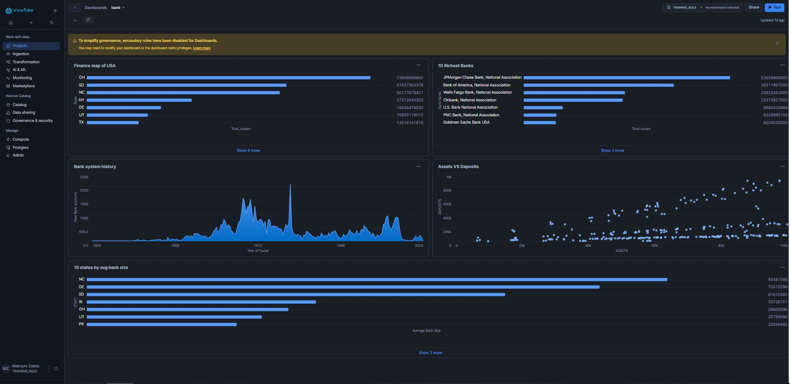
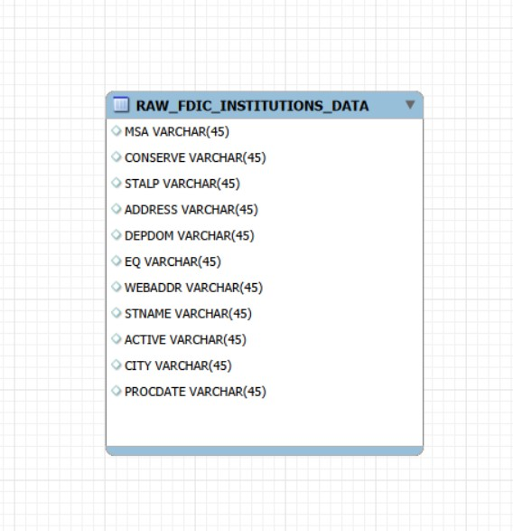
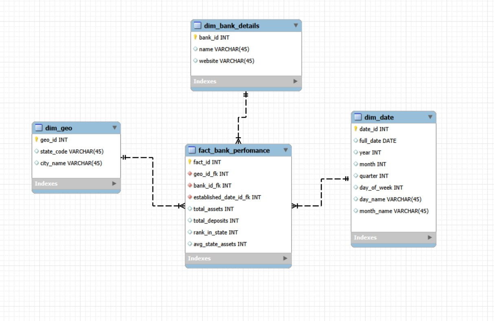
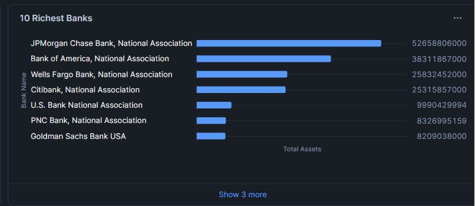
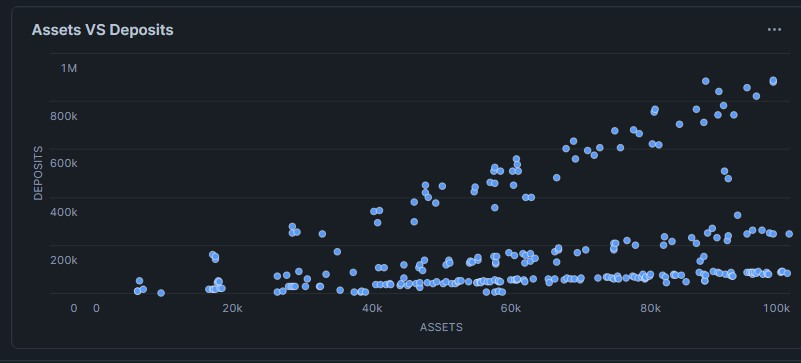
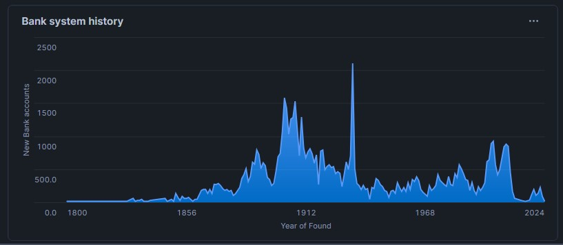
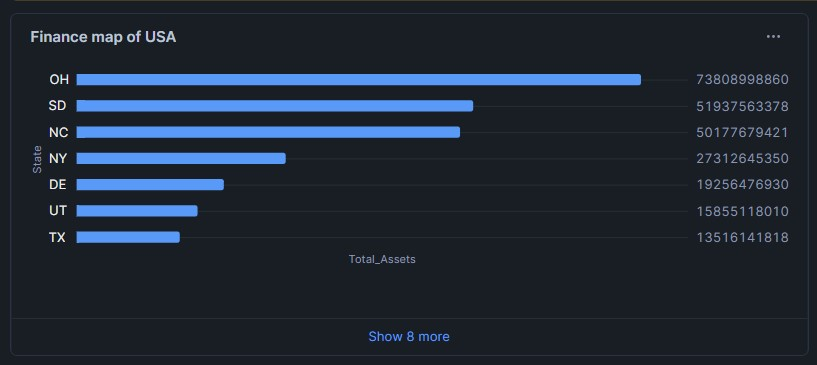
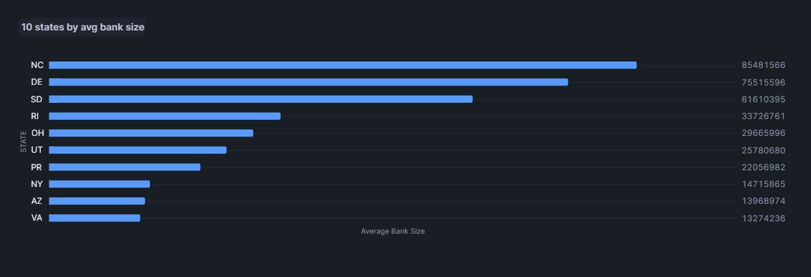

# Analysis of US Banking Institutions & Economic Trends 

This repository presents an end-to-end ELT (Extract, Load, Transform) project implemented in Snowflake. The goal was to transform raw, unstructured FDIC banking data into a structured Star Schema, which allows for analysis of the financial stability, geography, and historical growth of US banks.  

## 1. Introduction and Data Source 

The project analyses the financial reports of US banking institutions. 

This dataset was selected to analyze the stability of the US financial system using real-world regulatory data with deep historical context.

The primary business process supported by this data is **financial health monitoring and regulatory reporting** (FDIC assessments).


The main objectives were to determine: 

* The ratio between bank assets and deposits. 

* Capital in different US states. 

* Historical trends in the creation of new banks (1800–2025). 

* The largest financial institutions. 

**Key Dashboard:**

Below is the final analytical dashboard containing all key metrics.




Source Data: The dataset comes from the Snowflake Marketplace "Banking Analytics Bundle". Originally, the data was unstructured and denormalized like a single flat table, with columns such as:  
* **`FDIC_INSTITUTIONS`**: This is the master register of all FDIC-insured institutions. It contains identifying information, geographic location, and key financial indicators.

*  `MSA` (Bank Name)  
* `STALP` (State)  
* `ADDRESS` (Total Assets - stored as text)  
* `DEPDOM` (Total Deposits - stored as text)  
* `EQ` (Founding Date - stored as text)


### 1.1 Data architecture (ERD)


**Raw data (source):**

The source data existed in a ‘flat’ format typical for raw extracts, which required cleaning.



*Figure 1: Source Entity-Relationship Diagram (Raw Flat Structure)*

---

## 2. Dimensional Model

To support efficient analytics, a Star Schema was designed. The model consists of one Fact table and three Dimension tables:
* **`FACT_BANK_PERFORMANCE`**: The central fact table aggregating financial metrics.
    * **Primary Key:** `fact_id`
    * **Foreign Keys:** `bank_id_fk` (links to Bank Details), `geo_id_fk` (links to Geography), `established_date_id_fk` (links to Date).
    * **Metrics:** `total_assets`, `total_deposits`, `rank_in_state` (derived via window function), `avg_state_assets` (derived via window function).

* **`DIM_BANK_DETAILS`**: Contains descriptive attributes of the bank.
    * *Attributes:* Name, Website.
    * *SCD Type:* **Type 1** (updates overwrite previous values).

* **`DIM_GEO`**: Geographic hierarchy.
    * *Attributes:* State code, City name.
    * *SCD Type:* **Type 0** (static geographic data).

* **`DIM_DATE`**: Calendar attributes generated in snowflake from 1900 to 2050 year.
    * *Attributes:* Year, Quarter, Month, Full Date, Day of Week, Day Name, Month Name.
    * *SCD Type:* **Type 0** (fixed calendar data).



*Figure 2: Star Schema Optimized for Analytics*

---

## 3. ELT Process in Snowflake

The ELT Pipeline consists of three stages: ***Staging,** **Transormation** and **Loading***.

### 3.1 Extract & Load (Staging)

The data was extracted from the raw database `BANKING_RAW` and loaded into an intermediate table (`STAGING.stg_fdic_institutions`). At this stage, critical data was cleaned:
* Filtered out records with *Null* names.
* Applied `TRY_TO_NUMBER` in **filtering logic** (`WHERE` condition) to exclude invalid or non-numeric asset records before loading.

```sql
CREATE OR REPLACE TABLE stg_fdic_institutions (

    stg_id INT IDENTITY(1,1) PRIMARY KEY, 
    bank_name   STRING,
    city        STRING,
    state       STRING,
    asset_amt   INT, -- money
    deposit_amt INT,
    est_date    DATE,
    website     STRING
);

INSERT INTO stg_fdic_institutions (bank_name, city, state, asset_amt, deposit_amt, est_date, website)
SELECT 
    MSA,        -- bank name
    CONSERVE,   -- city
    STALP,      -- state
    ADDRESS, -- assets
    DEPDOM,  -- deposits
    EQ,        -- date of found
    WEBADDR     -- site
FROM BANKING_RAW.INSIGHTS.FDIC_INSTITUTIONS
WHERE MSA IS NOT NULL 
  AND TRY_TO_NUMBER(ADDRESS) > 0;

```

### 3.2 Transform (Dimension & Fact Creation)

SQL logic was used to fill in the star schema.

**Dimensions** were created using `DISTINCT` selects to ensure there are no duplicate records (uniqueness).
**Fact Table** was generated by linking dimensions via `JOIN` operations. **Window Functions** was also applied  (like `RANK` and `AVG`) to calculate advanced metrics directly inside the database effectively.

```sql
 -- DIMENSION
USE SCHEMA DWH;

-- geography
CREATE OR REPLACE TABLE DIM_GEO (
    geo_id INT IDENTITY(1,1) PRIMARY KEY,
    state_code STRING,
    city_name STRING
);

INSERT INTO DIM_GEO (state_code, city_name)
SELECT DISTINCT
    state,
    city
FROM STAGING.STG_FDIC_INSTITUTIONS WHERE state IS NOT NULL
ORDER BY state, city;


--Bank details
CREATE OR REPLACE TABLE DIM_BANK_DETAILS (
    bank_id INT PRIMARY KEY,
    name STRING,
    website STRING
);

INSERT INTO DIM_BANK_DETAILS (bank_id, name, website)
SELECT
    stg_id,
    bank_name,
    website
FROM STAGING.STG_FDIC_INSTITUTIONS;

CREATE OR REPLACE TABLE DIM_DATE (
    date_id INT IDENTITY(1,1) PRIMARY KEY,
    full_date DATE,
    year INT,
    month INT,
    quarter INT,
    day_of_week INT,
    day_name string,
    month_name string
);

-- Date
INSERT INTO DIM_DATE (full_date, year, month, quarter, day_of_week, day_name, month_name)
-- Temp table DATE_RANGE:
WITH DATE_RANGE AS (
    SELECT
        ROW_NUMBER() OVER (ORDER BY SEQ4()) - 1 AS row_num     -- insert number in each row
    FROM TABLE(GENERATOR(ROWCOUNT => 55000))    -- 365 * 150 = 55000
)
SELECT
    DATEADD(DAY, row_num, '1900-01-01') as my_date,
    YEAR(my_date),
    MONTH(my_date),
    QUARTER(my_date),
    DAYOFWEEK(my_date),
    --day_name:
    DECODE(DAYOFWEEK(my_date), 0, 'Sunday', 1, 'Monday', 2, 'Tuesday', 3, 'Wednesdady', 4, 'Thursday', 5, 'Friday', 6, 'Saturday'),
    MONTHNAME(my_date)
FROM DATE_RANGE
WHERE my_date <= '2050-12-31';

select * from DIM_DATE limit 5;

-- fact

CREATE OR REPLACE TABLE fact_bank_perfomance (
    fact_id INT IDENTITY(1, 1) PRIMARY key,
    bank_id_fk INT,
    geo_id_fk INT,
    established_date_id_fk INT,
    total_assets INT,
    total_deposits INT,
    rank_in_state INT,
    avg_state_assets INT
);

INSERT INTO fact_bank_perfomance (
    bank_id_fk, geo_id_fk, established_date_id_fk, total_assets, total_deposits, rank_in_state, avg_state_assets
)
SELECT
    b.bank_id,
    g.geo_id,
    d.date_id,
    s.asset_amt,
    s.deposit_amt,
    RANK() OVER (PARTITION BY s.state ORDER BY s.asset_amt DESC), -- window function
    AVG(s.asset_amt) OVER (PARTITION BY s.state)
FROM
    STAGING.stg_fdic_institutions s
JOIN DIM_BANK_DETAILS b ON s.stg_id = b.bank_id -- join operations
LEFT JOIN DIM_GEO g ON s.state = g.state_code and s.city = g.city_name
LEFT JOIN DIM_DATE d ON s.est_date = d.full_date;

```

**Cleanup:** After successfully loading the data into the Data Warehouse, the temporary staging table is removed to optimize storage.

```sql
USE SCHEMA STAGING;
DROP TABLE IF EXISTS stg_fdic_institutions;
```

## 4. Data Visualization & Insights

The final dataset was visualized to answer key business questions.

### Chart 1: Top 10 banks by total assets
Identify the largest financial players in the market. Query logic: combine total assets by bank name.

```sql
SELECT b.name as Bank_name,
SUM(f.total_assets) as Total_assets
From FACT_BANK_PERFOMANCE f
JOIN dim_bank_details b ON f.bank_id_fk = b.bank_id
GROUP BY b.name ORDER BY TOTAL_ASSETS DESC LIMIT 10;
```


*Figure 3: Top 10 Richest Banks*

### Chart 2: Assets vs. Deposits Correlation
Analyzing the relationship between a bank's size and its deposit volume. 

```sql
SELECT f.total_assets AS Assets,
    f.total_deposits AS Deposits,
    g.state_code AS State
FROM fact_bank_perfomance f
JOIN dim_geo g ON f.geo_id_fk = g.geo_id
WHERE f.total_assets < 100000
LIMIT 1000;
```



*Figure 4: Assets VS Deposits*

### Chart 3: Historical trends in the creation of new banks (1800–2025)
Tracking the expansion of the US banking system over two centuries.

```sql
SELECT d.year AS Year_of_Found, COUNT(f.bank_id_fk) AS New_Banks_account
FROM fact_bank_perfomance f
JOIN dim_date d ON f.established_date_id_fk = d.date_id
WHERE d.year >= 1800 and d.year <= 2025
GROUP BY d.year
ORDER By d.year;
```



*Figure 5: Bank System History*

### Chart 4: Geographic Analysis
Ranking states by total financial assets held by their banks.

```sql
SELECT 
    g.state_code AS State,
    SUM(f.total_assets) AS Total_Assets
FROM fact_bank_perfomance f
JOIN DIM_GEO g ON f.geo_id_fk = g.geo_id
GROUP BY g.state_code
ORDER BY Total_Assets DESC
LIMIT 15;
```



*Figure 6: Finance map of USA*

### Chart 5: 10 states with the largest average bank size
This chart shows the states with the largest average bank assets. 

```sql
SELECT DISTINCT g.state_code AS State,
f.avg_state_assets AS Average_bank_size
FROM fact_bank_perfomance f
JOIN dim_geo g ON f.geo_id_fk = g.geo_id
order by Average_bank_size DESC
LIMIT 10;
```


*Figure 7: 10 States by average bank size*

### Chart 6: Financial Volume
This chart shows the change in financial volume for the period from 2000 to 2025.
```
SELECT 
    d.year,
    SUM(f.total_assets) as total_assets_money,
    
FROM FACT_BANK_PERFOMANCE f
JOIN DIM_DATE d ON f.established_date_id_fk = d.DATE_ID -- join by est date
WHERE d.year >= 2000 -- last 20 years
GROUP BY d.year
ORDER BY d.year;
```


*Figure 8: Financial Volume*

### Chart 7: Bank Creating Activity
This chart visualizes the intensity of new players (banks) entering the market.
```
SELECT 
    d.year, 
    COUNT(f.fact_id) as banks_count,
FROM FACT_BANK_PERFOMANCE f
JOIN DIM_DATE d ON f.established_date_id_fk = d.DATE_ID -- join by est date
WHERE d.year >= 2000 -- last 20 years
GROUP BY d.year
ORDER BY d.year;
```


*Figure 9: Bank Ceating Activity*

Author:

Project by: Maksym Zaiets

Tools: Snowflake, SQL, MySQL Workbench
